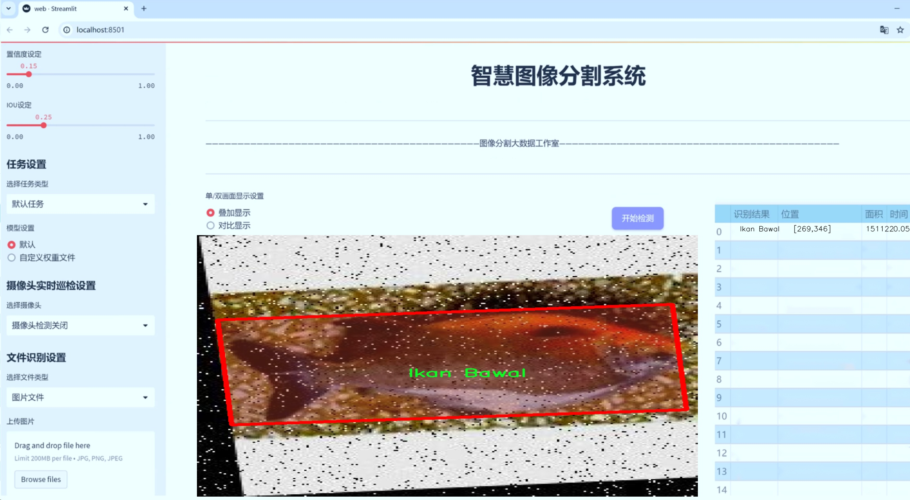
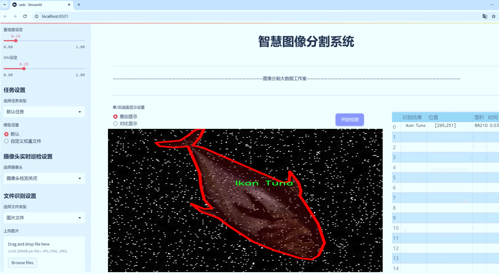
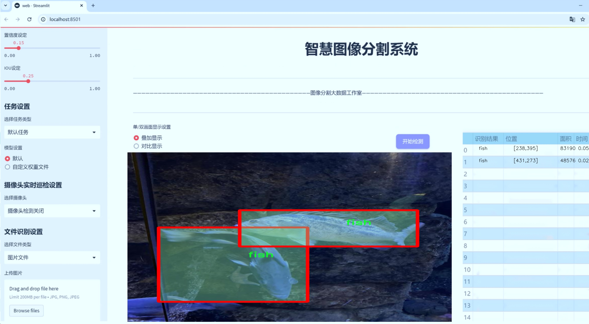
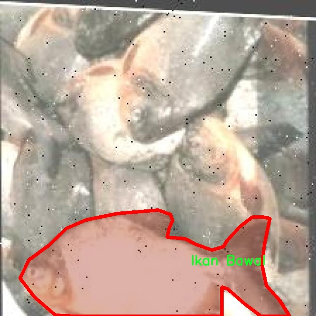
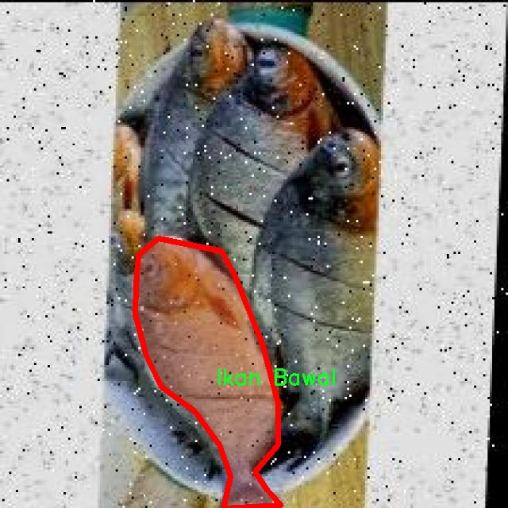
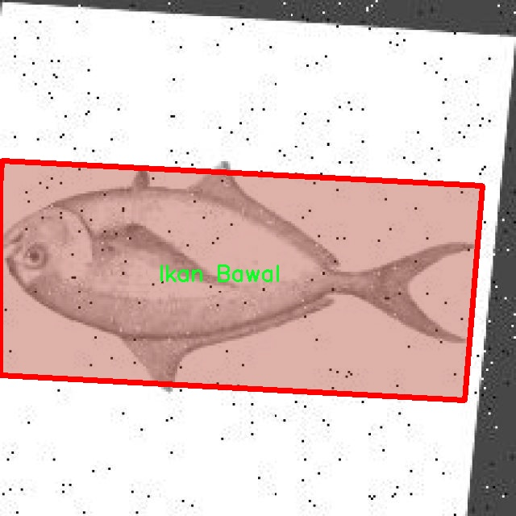
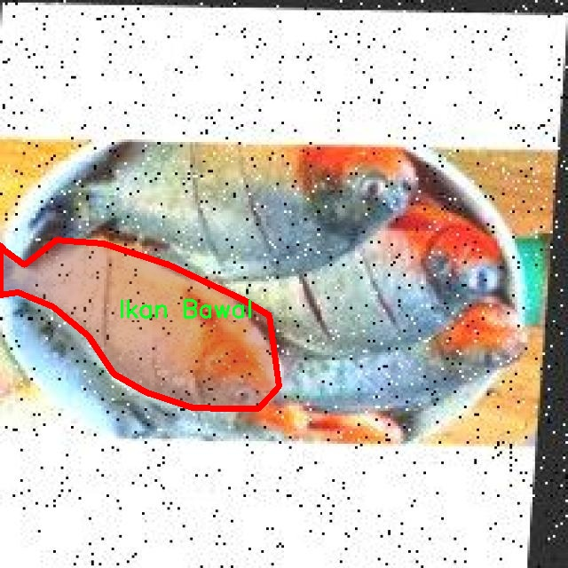
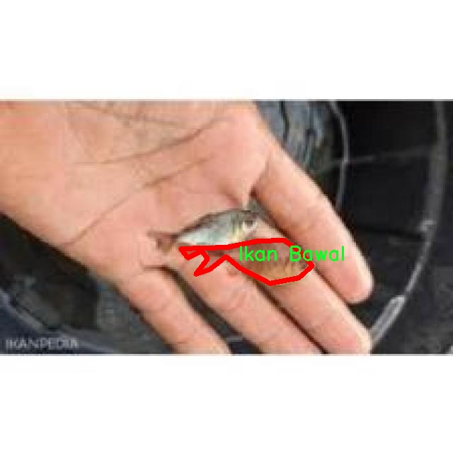

# 水生生物图像分割系统源码＆数据集分享
 [yolov8-seg＆yolov8-seg-GFPN等50+全套改进创新点发刊_一键训练教程_Web前端展示]

### 1.研究背景与意义

项目参考[ILSVRC ImageNet Large Scale Visual Recognition Challenge](https://gitee.com/YOLOv8_YOLOv11_Segmentation_Studio/projects)

项目来源[AAAI Global Al lnnovation Contest](https://kdocs.cn/l/cszuIiCKVNis)

研究背景与意义

随着全球水域生态环境的不断变化，水生生物的多样性和生态系统的健康状况日益受到关注。水生生物不仅在维持生态平衡、促进生物多样性方面发挥着重要作用，还对人类的经济活动、文化传承及科学研究具有深远的影响。为了有效监测和保护水生生物资源，研究者们亟需开发高效、准确的图像识别与分割技术，以便在各种环境条件下对水生生物进行自动化识别和分类。近年来，深度学习技术的迅猛发展为图像处理领域带来了新的机遇，尤其是目标检测和实例分割技术的应用，使得水生生物的自动识别和分类成为可能。

YOLO（You Only Look Once）系列模型作为一种高效的目标检测算法，因其实时性和高准确率而受到广泛关注。YOLOv8作为该系列的最新版本，进一步提升了检测精度和速度，适用于复杂背景下的图像分割任务。然而，针对水生生物的特定应用场景，YOLOv8的标准模型仍存在一定的局限性，尤其是在多类水生生物的实例分割任务中。为此，基于改进YOLOv8的水生生物图像分割系统的研究显得尤为重要。

本研究将利用包含1300幅图像和20个类别的水生生物数据集，涵盖了多种鱼类、虾类及其他水生生物，如水母、企鹅、鲨鱼等。这一丰富的数据集为模型的训练和验证提供了坚实的基础。通过对数据集的深入分析，我们可以识别出不同水生生物的特征，进而优化YOLOv8模型的结构和参数设置，以提高其在实例分割任务中的表现。特别是在处理水生生物的复杂背景、不同光照条件和多样化姿态时，改进后的模型将展现出更强的鲁棒性和适应性。

此外，基于改进YOLOv8的水生生物图像分割系统的研究不仅具有理论意义，还具有重要的实际应用价值。该系统能够为水生生物的监测、保护和管理提供高效的技术支持，助力生态环境保护和可持续发展。同时，借助该系统，科研人员可以更方便地获取水生生物的分布、数量及种类信息，为生态研究和政策制定提供数据支持。

综上所述，基于改进YOLOv8的水生生物图像分割系统的研究，不仅是对深度学习技术在水生生物领域应用的探索，也是对生态保护和生物多样性维护的重要贡献。通过本研究，我们期望能够推动水生生物监测技术的发展，为全球水域生态环境的保护和可持续利用提供有力的支持。

### 2.图片演示







##### 注意：由于此博客编辑较早，上面“2.图片演示”和“3.视频演示”展示的系统图片或者视频可能为老版本，新版本在老版本的基础上升级如下：（实际效果以升级的新版本为准）

  （1）适配了YOLOV8的“目标检测”模型和“实例分割”模型，通过加载相应的权重（.pt）文件即可自适应加载模型。

  （2）支持“图片识别”、“视频识别”、“摄像头实时识别”三种识别模式。

  （3）支持“图片识别”、“视频识别”、“摄像头实时识别”三种识别结果保存导出，解决手动导出（容易卡顿出现爆内存）存在的问题，识别完自动保存结果并导出到tempDir中。

  （4）支持Web前端系统中的标题、背景图等自定义修改，后面提供修改教程。

  另外本项目提供训练的数据集和训练教程,暂不提供权重文件（best.pt）,需要您按照教程进行训练后实现图片演示和Web前端界面演示的效果。

### 3.视频演示

[3.1 视频演示](https://www.bilibili.com/video/BV1eMSQYAE5t/)

### 4.数据集信息展示

##### 4.1 本项目数据集详细数据（类别数＆类别名）

nc: 20
names: ['Belut', 'Ikan Bawal', 'Ikan Gurame', 'Ikan Kakap', 'Ikan Kembung', 'Ikan Lele', 'Ikan Mas', 'Ikan Mujair', 'Ikan Nila', 'Ikan Tenggiri', 'Ikan Tongkol', 'Ikan Tuna', 'Udang', 'fish', 'jellyfish', 'penguin', 'puffin', 'shark', 'starfish', 'stingray']


##### 4.2 本项目数据集信息介绍

数据集信息展示

在本研究中，我们使用了名为“Species_fish”的数据集，以训练和改进YOLOv8-seg的水生生物图像分割系统。该数据集专注于水生生物的多样性，包含20个不同的类别，涵盖了从常见的鱼类到其他海洋生物的广泛范围。这些类别的多样性不仅为模型的训练提供了丰富的样本，也为其在实际应用中的泛化能力奠定了基础。

数据集中包含的20个类别分别是：Belut（鳗鱼）、Ikan Bawal（鲳鱼）、Ikan Gurame（桂花鱼）、Ikan Kakap（红鱼）、Ikan Kembung（青花鱼）、Ikan Lele（鲶鱼）、Ikan Mas（金鱼）、Ikan Mujair（穆贾尔鱼）、Ikan Nila（尼罗河鲈鱼）、Ikan Tenggiri（梭鱼）、Ikan Tongkol（黄鳍鲔）、Ikan Tuna（鲔鱼）、Udang（虾）、fish（鱼）、jellyfish（水母）、penguin（企鹅）、puffin（海雀）、shark（鲨鱼）、starfish（海星）和stingray（黄貂鱼）。这些类别的选择不仅反映了水生生态系统的多样性，也突显了我们在水生生物研究和保护方面的关注。

在图像分割任务中，YOLOv8-seg模型通过对输入图像进行像素级的分类，能够有效地识别和分割出各个类别的水生生物。数据集中的每个类别都包含了大量的标注图像，这些图像经过精心挑选和标注，确保了训练过程中模型能够接触到各种不同的样本。这种多样性对于模型的学习至关重要，因为它使得模型能够在面对新样本时，依然保持较高的识别准确率。

此外，数据集的设计也考虑到了不同水生生物在自然环境中的表现。每个类别的图像不仅展示了生物本身的特征，还考虑了其在水中运动的动态特性。这种动态特性为模型提供了更丰富的上下文信息，使其在分割时能够更好地理解生物与环境之间的关系。

通过对“Species_fish”数据集的使用，我们期望能够显著提升YOLOv8-seg在水生生物图像分割任务中的性能。数据集的多样性和丰富性为模型的训练提供了坚实的基础，使其能够更准确地识别和分割不同类别的水生生物。这不仅有助于科学研究，也为水生生态保护和资源管理提供了重要的技术支持。

综上所述，“Species_fish”数据集的构建和应用，体现了我们在水生生物图像分割领域的深入探索与创新。通过高质量的数据集，我们希望推动水生生物研究的进展，并为未来的生态保护工作提供强有力的技术支持。











### 5.全套项目环境部署视频教程（零基础手把手教学）

[5.1 环境部署教程链接（零基础手把手教学）](https://www.bilibili.com/video/BV1jG4Ve4E9t/?vd_source=bc9aec86d164b67a7004b996143742dc)


[5.2 安装Python虚拟环境创建和依赖库安装视频教程链接（零基础手把手教学）](https://www.bilibili.com/video/BV1nA4VeYEze/?vd_source=bc9aec86d164b67a7004b996143742dc)

### 6.手把手YOLOV8-seg训练视频教程（零基础小白有手就能学会）

[6.1 手把手YOLOV8-seg训练视频教程（零基础小白有手就能学会）](https://www.bilibili.com/video/BV1cA4VeYETe/?vd_source=bc9aec86d164b67a7004b996143742dc)


按照上面的训练视频教程链接加载项目提供的数据集，运行train.py即可开始训练



     Epoch   gpu_mem       box       obj       cls    labels  img_size
     1/200     0G   0.01576   0.01955  0.007536        22      1280: 100%|██████████| 849/849 [14:42<00:00,  1.04s/it]
               Class     Images     Labels          P          R     mAP@.5 mAP@.5:.95: 100%|██████████| 213/213 [01:14<00:00,  2.87it/s]
                 all       3395      17314      0.994      0.957      0.0957      0.0843

     Epoch   gpu_mem       box       obj       cls    labels  img_size
     2/200     0G   0.01578   0.01923  0.007006        22      1280: 100%|██████████| 849/849 [14:44<00:00,  1.04s/it]
               Class     Images     Labels          P          R     mAP@.5 mAP@.5:.95: 100%|██████████| 213/213 [01:12<00:00,  2.95it/s]
                 all       3395      17314      0.996      0.956      0.0957      0.0845

     Epoch   gpu_mem       box       obj       cls    labels  img_size
     3/200     0G   0.01561    0.0191  0.006895        27      1280: 100%|██████████| 849/849 [10:56<00:00,  1.29it/s]
               Class     Images     Labels          P          R     mAP@.5 mAP@.5:.95: 100%|███████   | 187/213 [00:52<00:00,  4.04it/s]
                 all       3395      17314      0.996      0.957      0.0957      0.0845


### 7.50+种全套YOLOV8-seg创新点代码加载调参视频教程（一键加载写好的改进模型的配置文件）

[7.1 50+种全套YOLOV8-seg创新点代码加载调参视频教程（一键加载写好的改进模型的配置文件）](https://www.bilibili.com/video/BV1Hw4VePEXv/?vd_source=bc9aec86d164b67a7004b996143742dc)

### 8.YOLOV8-seg图像分割算法原理

原始YOLOv8-seg算法原理

YOLOv8-seg算法作为YOLO系列的最新进展，继承并扩展了前几代YOLO模型的核心思想，旨在提供更高效的目标检测和分割能力。该算法的设计基于四个主要部分：输入层、主干网络、特征融合层和解耦头，这些部分的协同工作使得YOLOv8-seg在目标检测和分割任务中展现出卓越的性能。

在主干网络方面，YOLOv8-seg继续采用了YOLOv5的CSPDarknet结构，但进行了重要的改进。C3模块被替换为C2f模块，这一变化不仅实现了模型的轻量化，还保持了检测精度。C2f模块的设计灵感来源于YOLOv7的ELAN思想，其结构包括多个分支，通过引入shortcut连接，显著缓解了深层网络中的梯度消失问题。这种设计使得网络能够更有效地提取特征，尤其是在处理复杂场景时，能够更好地捕捉到目标的细节信息。

YOLOv8-seg在特征融合层中采用了PAN-FPN结构，进一步增强了多尺度特征的融合能力。通过自下而上的特征融合，YOLOv8-seg能够将高层特征与中层和浅层特征进行有效结合，确保了在不同尺度下的目标检测精度。特征融合不仅提高了网络对小目标的检测能力，还改善了对复杂背景下目标的分割效果。通过这种方式，YOLOv8-seg能够在多种应用场景中表现出色，如自动驾驶、安防监控等。

在检测头的设计上，YOLOv8-seg采用了解耦头结构，将分类和回归任务分开处理。这一创新的设计理念使得每个任务可以独立优化，从而提高了模型的整体性能。解耦头的引入使得YOLOv8-seg在处理复杂场景时，能够更准确地定位目标，并有效减少分类错误的发生。此外，YOLOv8-seg摒弃了传统的Anchor-Base方法，转而采用Anchor-Free的思想，直接通过回归方式预测目标的位置和大小。这一改变不仅简化了模型的设计，还提高了对不同形状和尺度目标的适应能力。

在损失函数的选择上，YOLOv8-seg引入了VFLLoss和DFLLoss+CIoULoss的组合，旨在优化分类和回归的训练过程。VFLLoss在处理样本不平衡问题上表现出色，能够有效提高模型对小目标的检测能力。而DFLLoss和CIoULoss的结合则增强了边框回归的精度，使得模型在目标定位上更加准确。这种损失函数的设计思路与YOLOv8-seg的整体架构相辅相成，确保了模型在训练过程中的高效收敛。

数据预处理是YOLOv8-seg算法中的另一个重要环节。通过采用YOLOv5的预处理策略，包括马赛克增强、混合增强、空间扰动和颜色扰动等多种增强手段，YOLOv8-seg能够有效提高训练数据的多样性，增强模型的泛化能力。这些数据增强技术在一定程度上缓解了过拟合问题，使得模型在实际应用中能够更好地适应不同的环境和条件。

在具体的实现过程中，YOLOv8-seg通过将输入图像调整为640x640的RGB格式，随后经过主干网络的特征提取，最终将提取到的特征送入特征融合层和解耦头进行目标检测和分割。整个过程高效而流畅，充分利用了YOLOv8-seg的网络结构优势，使得模型在实时检测和分割任务中表现出色。

总的来说，YOLOv8-seg算法在YOLO系列的基础上，通过一系列创新和改进，提升了目标检测和分割的性能。其独特的网络结构设计、有效的特征融合策略以及先进的损失函数选择，使得YOLOv8-seg在处理复杂场景时展现出强大的能力。随着YOLOv8-seg的不断发展和应用，未来的目标检测和分割任务将更加高效和精准。


### 9.系统功能展示（检测对象为举例，实际内容以本项目数据集为准）

图9.1.系统支持检测结果表格显示

  图9.2.系统支持置信度和IOU阈值手动调节

  图9.3.系统支持自定义加载权重文件best.pt(需要你通过步骤5中训练获得)

  图9.4.系统支持摄像头实时识别

  图9.5.系统支持图片识别

  图9.6.系统支持视频识别

  图9.7.系统支持识别结果文件自动保存

  图9.8.系统支持Excel导出检测结果数据


### 10.50+种全套YOLOV8-seg创新点原理讲解（非科班也可以轻松写刊发刊，V11版本正在科研待更新）

#### 10.1 由于篇幅限制，每个创新点的具体原理讲解就不一一展开，具体见下列网址中的创新点对应子项目的技术原理博客网址【Blog】：


[10.1 50+种全套YOLOV8-seg创新点原理讲解链接](https://gitee.com/qunmasj/good)

#### 10.2 部分改进模块原理讲解(完整的改进原理见上图和技术博客链接)【如果此小节的图加载失败可以通过CSDN或者Github搜索该博客的标题访问原始博客，原始博客图片显示正常】
### YOLOv8简介
YOLOv8 尚未发表论文，因此我们无法直接了解其创建过程中进行的直接研究方法和消融研究。话虽如此，我们分析了有关模型的存储库和可用信息，以开始记录 YOLOv8 中的新功能。

如果您想自己查看代码，请查看YOLOv8 存储库并查看此代码差异以了解一些研究是如何完成的。

在这里，我们提供了有影响力的模型更新的快速总结，然后我们将查看模型的评估，这不言自明。

GitHub 用户 RangeKing 制作的下图显示了网络架构的详细可视化。


在这里插入图片描述


在这里插入图片描述

YOLOv8 架构，GitHub 用户 RangeKing 制作的可视化

无锚检测
YOLOv8 是一个无锚模型。这意味着它直接预测对象的中心而不是已知锚框的偏移量。


YOLO中anchor box的可视化

锚框是早期 YOLO 模型中众所周知的棘手部分，因为它们可能代表目标基准框的分布，而不是自定义数据集的分布。


YOLOv8 的检测头，在netron.app中可视化

Anchor free 检测减少了框预测的数量，从而加速了非最大抑制 (NMS)，这是一个复杂的后处理步骤，在推理后筛选候选检测。


YOLOv8 的检测头，在netron.app中可视化

新的卷积
stem 的第一个6x6conv 被替换为 a 3x3，主要构建块被更改，并且C2f替换了C3。该模块总结如下图，其中“f”是特征数，“e”是扩展率，CBS是由a Conv、a BatchNorm、a组成的block SiLU。

在中， （两个具有剩余连接的 3x3C2f的奇特名称）的所有输出都被连接起来。而在仅使用最后一个输出。Bottleneck``convs``C3``Bottleneck


新的 YOLOv8C2f模块

这Bottleneck与 YOLOv5 中的相同，但第一个 conv 的内核大小从更改1x1为3x3. 从这些信息中，我们可以看到 YOLOv8 开始恢复到 2015 年定义的 ResNet 块。

在颈部，特征直接连接而不强制使用相同的通道尺寸。这减少了参数数量和张量的整体大小。

### 空间和通道重建卷积SCConv
参考该博客提出的一种高效的卷积模块，称为SCConv (spatial and channel reconstruction convolution)，以减少冗余计算并促进代表性特征的学习。提出的SCConv由空间重构单元(SRU)和信道重构单元(CRU)两个单元组成。

（1）SRU根据权重分离冗余特征并进行重构，以抑制空间维度上的冗余，增强特征的表征。

（2）CRU采用分裂变换和融合策略来减少信道维度的冗余以及计算成本和存储。

（3）SCConv是一种即插即用的架构单元，可直接用于替代各种卷积神经网络中的标准卷积。实验结果表明，scconvo嵌入模型能够通过减少冗余特征来获得更好的性能，并且显著降低了复杂度和计算成本。


SCConv如图所示，它由两个单元组成，空间重建单元(SRU)和通道重建单元(CRU)，以顺序的方式放置。具体而言，对于瓶颈残差块中的中间输入特征X，首先通过SRU运算获得空间细化特征Xw，然后利用CRU运算获得信道细化特征Y。SCConv模块充分利用了特征之间的空间冗余和通道冗余，可以无缝集成到任何CNN架构中，以减少中间特征映射之间的冗余并增强CNN的特征表示。

#### SRU单元用于空间冗余


为了利用特征的空间冗余，引入了空间重构单元(SRU)，如图2所示，它利用了分离和重构操作。

分离操作 的目的是将信息丰富的特征图与空间内容对应的信息较少的特征图分离开来。我们利用组归一化(GN)层中的比例因子来评估不同特征图的信息内容。具体来说，给定一个中间特征映射X∈R N×C×H×W，首先通过减去平均值µ并除以标准差σ来标准化输入特征X，如下所示:


其中µ和σ是X的均值和标准差，ε是为了除法稳定性而加入的一个小的正常数，γ和β是可训练的仿射变换。

GN层中的可训练参数\gamma \in R^{C}用于测量每个批次和通道的空间像素方差。更丰富的空间信息反映了空间像素的更多变化，从而导致更大的γ。归一化相关权重W_{\gamma} \in R^{C}由下面公式2得到，表示不同特征映射的重要性。


然后将经Wγ重新加权的特征映射的权值通过sigmoid函数映射到(0,1)范围，并通过阈值进行门控。我们将阈值以上的权重设置为1，得到信息权重W1，将其设置为0，得到非信息权重W2(实验中阈值设置为0.5)。获取W的整个过程可以用公式表示。


最后将输入特征X分别乘以W1和W2，得到两个加权特征:信息量较大的特征X_{1}^{\omega }和信息量较小的特征X_{2}^{\omega }。这样就成功地将输入特征分为两部分:X_{1}^{\omega }具有信息量和表达性的空间内容，而X_{2}^{\omega }几乎没有信息，被认为是冗余的。

重构操作 将信息丰富的特征与信息较少的特征相加，生成信息更丰富的特征，从而节省空间空间。采用交叉重构运算，将加权后的两个不同的信息特征充分结合起来，加强它们之间的信息流。然后将交叉重构的特征X^{\omega1}和X^{\omega2}进行拼接，得到空间精细特征映射X^{\omega}。从后过程表示如下：


其中⊗是逐元素的乘法，⊕是逐元素的求和，∪是串联。将SRU应用于中间输入特征X后，不仅将信息特征与信息较少的特征分离，而且对其进行重构，增强代表性特征，抑制空间维度上的冗余特征。然而，空间精细特征映射X^{\omega}在通道维度上仍然是冗余的。

#### CRU单元用于通道冗余


分割 操作将输入的空间细化特征X^{\omega}分割成两个部分，一部分通道数是\alpha C，另一部分通道数是(1-\alpha) C，随后对两组特征的通道数使用1 * 1卷积核进行压缩，分别得到X_{up}和X_{low}。

转换 操作将输入的X_{up}作为“富特征提取”的输入，分别进行GWC和PWC，然后相加得到输出Y1，将输入X_{low}作为“富特征提取”的补充，进行PWC，得到的记过和原来的输入取并集得到Y2。

融合 操作使用简化的SKNet方法来自适应合并Y1和Y2。具体说是首先使用全局平均池化将全局空间信息和通道统计信息结合起来，得到经过池化的S1和S2。然后对S1和S2做Softmax得到特征权重向量\beta _{1}和\beta _{2}，最后使用特征权重向量得到输出Y = \beta _{1}*Y_{1} + \beta _{2}*Y_{2}，Y即为通道提炼的特征。


### 11.项目核心源码讲解（再也不用担心看不懂代码逻辑）

#### 11.1 ultralytics\utils\loss.py

以下是对代码中最核心部分的提取和详细中文注释：

```python
import torch
import torch.nn as nn
import torch.nn.functional as F

class BboxLoss(nn.Module):
    def __init__(self, reg_max, use_dfl=False):
        """初始化边界框损失模块，设置最大正则化和DFL选项。"""
        super().__init__()
        self.reg_max = reg_max  # 最大正则化值
        self.use_dfl = use_dfl  # 是否使用分布焦点损失
        self.iou_ratio = 0.5  # IoU损失比例

    def forward(self, pred_dist, pred_bboxes, anchor_points, target_bboxes, target_scores, target_scores_sum, fg_mask):
        """计算IoU损失和DFL损失。"""
        weight = target_scores.sum(-1)[fg_mask].unsqueeze(-1)  # 计算权重
        iou = bbox_iou(pred_bboxes[fg_mask], target_bboxes[fg_mask], xywh=False, CIoU=True)  # 计算IoU

        # IoU损失
        loss_iou = ((1.0 - iou) * weight).sum() / target_scores_sum
        
        # DFL损失
        if self.use_dfl:
            target_ltrb = bbox2dist(anchor_points, target_bboxes, self.reg_max)  # 转换目标边界框为分布格式
            loss_dfl = self._df_loss(pred_dist[fg_mask].view(-1, self.reg_max + 1), target_ltrb[fg_mask]) * weight
            loss_dfl = loss_dfl.sum() / target_scores_sum
        else:
            loss_dfl = torch.tensor(0.0).to(pred_dist.device)  # 如果不使用DFL，损失为0

        return loss_iou, loss_dfl  # 返回IoU损失和DFL损失

    @staticmethod
    def _df_loss(pred_dist, target):
        """计算分布焦点损失。"""
        tl = target.long()  # 目标左边界
        tr = tl + 1  # 目标右边界
        wl = tr - target  # 左边权重
        wr = 1 - wl  # 右边权重
        return (F.cross_entropy(pred_dist, tl.view(-1), reduction='none').view(tl.shape) * wl +
                F.cross_entropy(pred_dist, tr.view(-1), reduction='none').view(tl.shape) * wr).mean(-1, keepdim=True)

class v8DetectionLoss:
    """计算检测损失的标准类。"""

    def __init__(self, model):
        """初始化v8DetectionLoss，设置模型相关属性和BCE损失函数。"""
        device = next(model.parameters()).device  # 获取模型设备
        m = model.model[-1]  # 获取检测模块
        self.bce = nn.BCEWithLogitsLoss(reduction='none')  # 二元交叉熵损失
        self.reg_max = m.reg_max  # 最大正则化值
        self.device = device  # 设备

        self.bbox_loss = BboxLoss(m.reg_max - 1, use_dfl=True).to(device)  # 初始化边界框损失

    def __call__(self, preds, batch):
        """计算损失并返回。"""
        loss = torch.zeros(3, device=self.device)  # 初始化损失（边界框、类别、DFL）
        pred_distri, pred_scores = preds  # 获取预测分布和分数

        # 处理目标
        targets = torch.cat((batch['batch_idx'].view(-1, 1), batch['cls'].view(-1, 1), batch['bboxes']), 1)
        gt_labels, gt_bboxes = targets.split((1, 4), 2)  # 类别和边界框

        # 计算边界框损失
        pred_bboxes = self.bbox_decode(pred_distri)  # 解码预测边界框
        if batch['fg_mask'].sum():  # 如果有前景
            loss[0], loss[2] = self.bbox_loss(pred_distri, pred_bboxes, batch['anchor_points'], gt_bboxes, batch['target_scores'], batch['target_scores_sum'], batch['fg_mask'])

        # 计算类别损失
        loss[1] = self.bce(pred_scores, batch['target_scores'].to(pred_scores.dtype)).sum() / max(batch['target_scores'].sum(), 1)  # 类别损失

        return loss.sum() * batch['batch_size'], loss.detach()  # 返回总损失和分离的损失
```

### 代码核心部分解释：
1. **BboxLoss类**：
   - 该类用于计算边界框的损失，包括IoU损失和可选的分布焦点损失（DFL）。
   - `forward`方法计算IoU损失和DFL损失，返回这两个损失值。

2. **v8DetectionLoss类**：
   - 该类用于计算YOLOv8模型的检测损失。
   - 在初始化时，它设置了损失函数和模型的相关参数。
   - `__call__`方法计算并返回总损失，包括边界框损失和类别损失。

### 其他注意事项：
- 代码中使用了PyTorch的张量操作和损失函数，确保在GPU上运行时的高效性。
- 代码中有对目标的处理，包括对类别和边界框的提取和解码。
- 这些损失函数是YOLO模型训练的关键部分，直接影响模型的性能和准确性。

这个文件是一个用于计算损失函数的模块，主要用于Ultralytics YOLO（You Only Look Once）目标检测和分割模型的训练。文件中定义了多个损失类，每个类实现了不同的损失计算方法，以适应不同的任务需求。

首先，`SlideLoss`和`EMASlideLoss`类用于实现滑动损失（Slide Loss）和指数移动平均滑动损失（EMA Slide Loss）。这两种损失通过对每个元素的损失进行加权来调整损失值，特别是在IoU（Intersection over Union）较低的情况下，损失会被放大，从而引导模型更好地学习。

接下来，`VarifocalLoss`和`FocalLoss`类实现了变焦损失和焦点损失。变焦损失是通过调整预测分数的权重来提高模型对难以分类样本的关注度，而焦点损失则通过增加难分类样本的损失来实现类似的效果。

`BboxLoss`类则专注于边界框的损失计算。它结合了IoU损失和分布焦点损失（DFL），可以根据预测的边界框和目标边界框之间的重叠程度来计算损失。DFL通过对边界框的分布进行建模，来提高边界框回归的精度。

`KeypointLoss`类用于计算关键点的损失，主要用于姿态估计任务。它通过计算预测关键点与真实关键点之间的欧几里得距离来评估模型的性能。

`v8DetectionLoss`类是一个综合性的损失计算类，整合了上述损失函数以计算目标检测任务的总损失。它处理输入的预测和目标数据，计算边界框损失、分类损失和DFL损失，并根据超参数进行加权。

`v8SegmentationLoss`和`v8PoseLoss`类则是专门为分割和姿态估计任务设计的损失计算类，分别扩展了`v8DetectionLoss`类，增加了对分割掩码和关键点的处理。

最后，`v8ClassificationLoss`类用于计算分类任务的损失，使用交叉熵损失函数来评估模型的分类性能。

整体来看，这个文件通过定义多种损失函数，为YOLO模型的训练提供了灵活的损失计算机制，以适应不同的任务需求和数据特性。

#### 11.2 ultralytics\trackers\utils\kalman_filter.py

以下是代码中最核心的部分，并附上详细的中文注释：

```python
import numpy as np
import scipy.linalg

class KalmanFilterXYAH:
    """
    Kalman滤波器，用于在图像空间中跟踪边界框。
    状态空间为8维，包含边界框中心位置(x, y)、长宽比a、高度h及其各自的速度。
    物体运动遵循恒定速度模型。
    """

    def __init__(self):
        """初始化Kalman滤波器模型矩阵，设置运动和观测的不确定性权重。"""
        ndim, dt = 4, 1.  # 状态维度和时间步长

        # 创建Kalman滤波器模型矩阵
        self._motion_mat = np.eye(2 * ndim, 2 * ndim)  # 运动矩阵
        for i in range(ndim):
            self._motion_mat[i, ndim + i] = dt  # 设置速度的影响
        self._update_mat = np.eye(ndim, 2 * ndim)  # 更新矩阵

        # 设置运动和观测的不确定性权重
        self._std_weight_position = 1. / 20
        self._std_weight_velocity = 1. / 160

    def initiate(self, measurement):
        """
        从未关联的测量值创建跟踪。

        参数
        ----------
        measurement : ndarray
            边界框坐标(x, y, a, h)，其中(x, y)为中心位置，a为长宽比，h为高度。

        返回
        -------
        (ndarray, ndarray)
            返回新跟踪的均值向量(8维)和协方差矩阵(8x8维)。
        """
        mean_pos = measurement  # 位置均值
        mean_vel = np.zeros_like(mean_pos)  # 速度均值初始化为0
        mean = np.r_[mean_pos, mean_vel]  # 合并位置和速度均值

        # 计算协方差矩阵的标准差
        std = [
            2 * self._std_weight_position * measurement[3],  # 高度相关的标准差
            2 * self._std_weight_position * measurement[3],
            1e-2,  # 长宽比的标准差
            2 * self._std_weight_position * measurement[3],
            10 * self._std_weight_velocity * measurement[3],  # 速度相关的标准差
            10 * self._std_weight_velocity * measurement[3],
            1e-5,  # 长宽比速度的标准差
            10 * self._std_weight_velocity * measurement[3]
        ]
        covariance = np.diag(np.square(std))  # 协方差矩阵
        return mean, covariance

    def predict(self, mean, covariance):
        """
        执行Kalman滤波器预测步骤。

        参数
        ----------
        mean : ndarray
            上一时间步的状态均值向量(8维)。
        covariance : ndarray
            上一时间步的状态协方差矩阵(8x8维)。

        返回
        -------
        (ndarray, ndarray)
            返回预测状态的均值向量和协方差矩阵。
        """
        # 计算位置和速度的标准差
        std_pos = [
            self._std_weight_position * mean[3], 
            self._std_weight_position * mean[3], 
            1e-2, 
            self._std_weight_position * mean[3]
        ]
        std_vel = [
            self._std_weight_velocity * mean[3], 
            self._std_weight_velocity * mean[3], 
            1e-5, 
            self._std_weight_velocity * mean[3]
        ]
        motion_cov = np.diag(np.square(np.r_[std_pos, std_vel]))  # 运动协方差矩阵

        mean = np.dot(mean, self._motion_mat.T)  # 更新均值
        covariance = np.linalg.multi_dot((self._motion_mat, covariance, self._motion_mat.T)) + motion_cov  # 更新协方差

        return mean, covariance

    def update(self, mean, covariance, measurement):
        """
        执行Kalman滤波器校正步骤。

        参数
        ----------
        mean : ndarray
            预测状态的均值向量(8维)。
        covariance : ndarray
            状态的协方差矩阵(8x8维)。
        measurement : ndarray
            4维测量向量(x, y, a, h)，其中(x, y)为中心位置，a为长宽比，h为高度。

        返回
        -------
        (ndarray, ndarray)
            返回经过测量校正后的状态分布。
        """
        projected_mean, projected_cov = self.project(mean, covariance)  # 投影到测量空间

        # 计算卡尔曼增益
        chol_factor, lower = scipy.linalg.cho_factor(projected_cov, lower=True, check_finite=False)
        kalman_gain = scipy.linalg.cho_solve((chol_factor, lower),
                                             np.dot(covariance, self._update_mat.T).T,
                                             check_finite=False).T
        innovation = measurement - projected_mean  # 计算创新

        new_mean = mean + np.dot(innovation, kalman_gain.T)  # 更新均值
        new_covariance = covariance - np.linalg.multi_dot((kalman_gain, projected_cov, kalman_gain.T))  # 更新协方差
        return new_mean, new_covariance
```

### 代码核心部分说明：
1. **KalmanFilterXYAH类**：实现了一个简单的Kalman滤波器，用于跟踪图像中的边界框，状态空间包含位置、长宽比、高度及其速度。
2. **初始化方法**：设置了运动和观测的不确定性权重，并创建了运动和更新矩阵。
3. **initiate方法**：根据测量值初始化状态均值和协方差矩阵。
4. **predict方法**：根据当前状态均值和协方差矩阵进行预测，更新状态。
5. **update方法**：根据新的测量值更新状态均值和协方差矩阵，计算卡尔曼增益和创新。

这个简化版本保留了Kalman滤波器的核心逻辑，并提供了详细的中文注释以帮助理解。

这个程序文件实现了一个简单的卡尔曼滤波器，用于在图像空间中跟踪边界框。它包含两个类：`KalmanFilterXYAH`和`KalmanFilterXYWH`，分别用于处理不同的边界框表示形式。

`KalmanFilterXYAH`类用于处理包含中心位置（x, y）、长宽比（a）和高度（h）的边界框，状态空间是8维的，包括位置、长宽比、高度及其各自的速度。该类的初始化方法中创建了运动矩阵和更新矩阵，并定义了运动和观测的不确定性权重。`initiate`方法根据输入的测量值（边界框坐标）初始化状态均值和协方差矩阵，未观测的速度初始化为0。

`predict`方法执行卡尔曼滤波的预测步骤，更新状态均值和协方差矩阵。`project`方法将状态分布投影到测量空间，返回投影后的均值和协方差。`multi_predict`方法是向量化版本的预测步骤，适用于多个状态的同时预测。`update`方法执行卡尔曼滤波的校正步骤，根据新的测量值更新状态均值和协方差。

`gating_distance`方法计算状态分布与测量值之间的门控距离，使用马哈拉诺比斯距离或高斯距离进行度量。该方法允许只考虑位置或同时考虑位置和其他状态信息。

`KalmanFilterXYWH`类继承自`KalmanFilterXYAH`，用于处理包含中心位置（x, y）、宽度（w）和高度（h）的边界框。它重写了`initiate`、`predict`、`project`和`multi_predict`方法，以适应新的状态表示形式，但其更新方法直接调用父类的实现。

整体而言，这个文件实现了卡尔曼滤波器的基本功能，能够有效地跟踪图像中的物体，适用于计算机视觉中的目标跟踪任务。

#### 11.3 ultralytics\nn\extra_modules\RFAConv.py

以下是经过简化和注释的核心代码部分：

```python
import torch
import torch.nn as nn
from einops import rearrange

# 定义一个h-sigmoid激活函数
class h_sigmoid(nn.Module):
    def __init__(self, inplace=True):
        super(h_sigmoid, self).__init__()
        self.relu = nn.ReLU6(inplace=inplace)  # 使用ReLU6作为基础

    def forward(self, x):
        return self.relu(x + 3) / 6  # 计算h-sigmoid

# 定义一个h-swish激活函数
class h_swish(nn.Module):
    def __init__(self, inplace=True):
        super(h_swish, self).__init__()
        self.sigmoid = h_sigmoid(inplace=inplace)  # 使用h-sigmoid作为基础

    def forward(self, x):
        return x * self.sigmoid(x)  # 计算h-swish

# 定义RFAConv类
class RFAConv(nn.Module):
    def __init__(self, in_channel, out_channel, kernel_size, stride=1):
        super().__init__()
        self.kernel_size = kernel_size

        # 权重生成模块
        self.get_weight = nn.Sequential(
            nn.AvgPool2d(kernel_size=kernel_size, padding=kernel_size // 2, stride=stride),
            nn.Conv2d(in_channel, in_channel * (kernel_size ** 2), kernel_size=1, groups=in_channel, bias=False)
        )
        
        # 特征生成模块
        self.generate_feature = nn.Sequential(
            nn.Conv2d(in_channel, in_channel * (kernel_size ** 2), kernel_size=kernel_size, padding=kernel_size // 2, stride=stride, groups=in_channel, bias=False),
            nn.BatchNorm2d(in_channel * (kernel_size ** 2)),
            nn.ReLU()
        )
        
        # 最终卷积层
        self.conv = nn.Conv2d(in_channel, out_channel, kernel_size=kernel_size, stride=kernel_size)

    def forward(self, x):
        b, c = x.shape[0:2]  # 获取批量大小和通道数
        weight = self.get_weight(x)  # 生成权重
        h, w = weight.shape[2:]  # 获取特征图的高和宽
        
        # 计算加权特征
        weighted = weight.view(b, c, self.kernel_size ** 2, h, w).softmax(2)  # 计算softmax
        feature = self.generate_feature(x).view(b, c, self.kernel_size ** 2, h, w)  # 生成特征
        weighted_data = feature * weighted  # 加权特征
        
        # 重新排列特征以适应卷积层
        conv_data = rearrange(weighted_data, 'b c (n1 n2) h w -> b c (h n1) (w n2)', n1=self.kernel_size, n2=self.kernel_size)
        return self.conv(conv_data)  # 返回卷积结果

# 定义SE模块（Squeeze-and-Excitation）
class SE(nn.Module):
    def __init__(self, in_channel, ratio=16):
        super(SE, self).__init__()
        self.gap = nn.AdaptiveAvgPool2d((1, 1))  # 全局平均池化
        self.fc = nn.Sequential(
            nn.Linear(in_channel, ratio, bias=False),  # 线性层
            nn.ReLU(),
            nn.Linear(ratio, in_channel, bias=False),  # 线性层
            nn.Sigmoid()  # Sigmoid激活
        )

    def forward(self, x):
        b, c = x.shape[0:2]  # 获取批量大小和通道数
        y = self.gap(x).view(b, c)  # 进行全局平均池化
        y = self.fc(y).view(b, c, 1, 1)  # 通过全连接层
        return y  # 返回通道注意力

# 定义RFCBAMConv类
class RFCBAMConv(nn.Module):
    def __init__(self, in_channel, out_channel, kernel_size=3, stride=1):
        super().__init__()
        self.kernel_size = kernel_size
        
        # 特征生成模块
        self.generate = nn.Sequential(
            nn.Conv2d(in_channel, in_channel * (kernel_size ** 2), kernel_size, padding=kernel_size // 2, stride=stride, groups=in_channel, bias=False),
            nn.BatchNorm2d(in_channel * (kernel_size ** 2)),
            nn.ReLU()
        )
        
        # 权重生成模块
        self.get_weight = nn.Sequential(nn.Conv2d(2, 1, kernel_size=3, padding=1, bias=False), nn.Sigmoid())
        self.se = SE(in_channel)  # 通道注意力模块

        # 最终卷积层
        self.conv = nn.Conv2d(in_channel, out_channel, kernel_size=kernel_size, stride=kernel_size)

    def forward(self, x):
        b, c = x.shape[0:2]  # 获取批量大小和通道数
        channel_attention = self.se(x)  # 计算通道注意力
        generate_feature = self.generate(x)  # 生成特征

        h, w = generate_feature.shape[2:]  # 获取特征图的高和宽
        generate_feature = generate_feature.view(b, c, self.kernel_size ** 2, h, w)  # 重新排列特征
        
        # 重新排列特征以适应卷积层
        generate_feature = rearrange(generate_feature, 'b c (n1 n2) h w -> b c (h n1) (w n2)', n1=self.kernel_size, n2=self.kernel_size)
        
        # 计算加权特征
        unfold_feature = generate_feature * channel_attention
        max_feature, _ = torch.max(generate_feature, dim=1, keepdim=True)  # 最大特征
        mean_feature = torch.mean(generate_feature, dim=1, keepdim=True)  # 平均特征
        receptive_field_attention = self.get_weight(torch.cat((max_feature, mean_feature), dim=1))  # 计算感受野注意力
        conv_data = unfold_feature * receptive_field_attention  # 加权特征
        return self.conv(conv_data)  # 返回卷积结果
```

### 代码注释说明：
1. **h_sigmoid 和 h_swish**: 这两个类实现了特定的激活函数，分别是h-sigmoid和h-swish，常用于深度学习模型中以提高非线性表达能力。
2. **RFAConv**: 该类实现了一种卷积层，使用了特征生成和权重生成的机制，通过加权特征进行卷积操作。
3. **SE**: Squeeze-and-Excitation模块，用于计算通道注意力，通过全局平均池化和全连接层实现。
4. **RFCBAMConv**: 该类结合了特征生成、通道注意力和感受野注意力的机制，增强了卷积操作的表达能力。

整体上，这段代码实现了一些复杂的卷积操作，结合了注意力机制，以提高模型的性能。

这个程序文件定义了一些用于深度学习的卷积模块，主要包括RFAConv、RFCBAMConv和RFCAConv等类。首先，文件导入了必要的库，包括PyTorch和一些自定义的卷积模块。接下来，定义了几个激活函数类：h_sigmoid和h_swish，它们分别实现了修正的Sigmoid和Swish激活函数，这些函数在深度学习中常用于提高模型的非线性表达能力。

RFAConv类是一个特殊的卷积层，它的构造函数接收输入通道数、输出通道数、卷积核大小和步幅。这个类的核心在于其前向传播方法，它首先通过一个平均池化层和卷积层生成权重，然后生成特征图，接着将权重与特征图相乘，最后通过重排操作和自定义的卷积层进行卷积计算。

RFCBAMConv类在RFAConv的基础上增加了通道注意力机制。它通过SE（Squeeze-and-Excitation）模块来生成通道注意力，结合最大池化和平均池化的特征图来计算注意力权重。然后，经过卷积操作，输出最终的特征图。

RFCAConv类则进一步扩展了功能，结合了空间注意力机制。它在生成特征图后，通过自适应平均池化分别计算高度和宽度的特征，然后将它们拼接在一起，经过一系列卷积和激活操作生成注意力权重。最后，将生成的特征图与空间注意力相乘，得到最终的输出。

整个文件实现了多种卷积模块，结合了不同的注意力机制，旨在提高卷积神经网络在特征提取和表示学习方面的能力。这些模块可以被用于构建更复杂的神经网络架构，以适应各种计算机视觉任务。

#### 11.4 ultralytics\models\utils\loss.py

以下是经过简化和注释的核心代码部分，主要包括损失计算的核心逻辑：

```python
import torch
import torch.nn as nn
import torch.nn.functional as F
from ultralytics.utils.metrics import bbox_iou
from .ops import HungarianMatcher

class DETRLoss(nn.Module):
    """
    DETR (DEtection TRansformer) 损失类。该类计算并返回DETR目标检测模型的不同损失组件。
    包括分类损失、边界框损失、GIoU损失等。
    """

    def __init__(self, nc=80, loss_gain=None, aux_loss=True, use_fl=True, use_vfl=False):
        """
        初始化DETR损失函数。

        Args:
            nc (int): 类别数量。
            loss_gain (dict): 各种损失的系数。
            aux_loss (bool): 是否计算辅助损失。
            use_fl (bool): 是否使用FocalLoss。
            use_vfl (bool): 是否使用VarifocalLoss。
        """
        super().__init__()
        # 设置损失系数
        if loss_gain is None:
            loss_gain = {'class': 1, 'bbox': 5, 'giou': 2}
        self.nc = nc
        self.loss_gain = loss_gain
        self.aux_loss = aux_loss
        self.matcher = HungarianMatcher(cost_gain={'class': 2, 'bbox': 5, 'giou': 2})
        self.fl = FocalLoss() if use_fl else None
        self.vfl = VarifocalLoss() if use_vfl else None

    def _get_loss_class(self, pred_scores, targets, gt_scores, num_gts):
        """计算分类损失。"""
        bs, nq = pred_scores.shape[:2]
        # 创建one-hot编码的目标
        one_hot = torch.zeros((bs, nq, self.nc + 1), dtype=torch.int64, device=targets.device)
        one_hot.scatter_(2, targets.unsqueeze(-1), 1)
        one_hot = one_hot[..., :-1]  # 去掉背景类

        gt_scores = gt_scores.view(bs, nq, 1) * one_hot  # 计算真实分数

        # 计算损失
        if self.fl:
            loss_cls = self.vfl(pred_scores, gt_scores, one_hot) if num_gts else self.fl(pred_scores, one_hot.float())
            loss_cls /= max(num_gts, 1) / nq
        else:
            loss_cls = nn.BCEWithLogitsLoss(reduction='none')(pred_scores, gt_scores).mean(1).sum()

        return {'loss_class': loss_cls.squeeze() * self.loss_gain['class']}

    def _get_loss_bbox(self, pred_bboxes, gt_bboxes):
        """计算边界框损失和GIoU损失。"""
        loss = {}
        if len(gt_bboxes) == 0:
            return {'loss_bbox': torch.tensor(0.), 'loss_giou': torch.tensor(0.)}

        # 计算L1损失
        loss['loss_bbox'] = self.loss_gain['bbox'] * F.l1_loss(pred_bboxes, gt_bboxes, reduction='sum') / len(gt_bboxes)
        # 计算GIoU损失
        loss['loss_giou'] = 1.0 - bbox_iou(pred_bboxes, gt_bboxes, xywh=True, GIoU=True)
        loss['loss_giou'] = loss['loss_giou'].sum() / len(gt_bboxes) * self.loss_gain['giou']
        return loss

    def _get_loss(self, pred_bboxes, pred_scores, gt_bboxes, gt_cls):
        """获取所有损失。"""
        match_indices = self.matcher(pred_bboxes, pred_scores, gt_bboxes, gt_cls)
        idx, gt_idx = self._get_index(match_indices)
        pred_bboxes, gt_bboxes = pred_bboxes[idx], gt_bboxes[gt_idx]

        bs, nq = pred_scores.shape[:2]
        targets = torch.full((bs, nq), self.nc, device=pred_scores.device, dtype=gt_cls.dtype)
        targets[idx] = gt_cls[gt_idx]

        gt_scores = torch.zeros([bs, nq], device=pred_scores.device)
        if len(gt_bboxes):
            gt_scores[idx] = bbox_iou(pred_bboxes.detach(), gt_bboxes, xywh=True).squeeze(-1)

        loss = {}
        loss.update(self._get_loss_class(pred_scores, targets, gt_scores, len(gt_bboxes)))
        loss.update(self._get_loss_bbox(pred_bboxes, gt_bboxes))
        return loss

    def forward(self, pred_bboxes, pred_scores, batch):
        """
        前向传播，计算损失。

        Args:
            pred_bboxes (torch.Tensor): 预测的边界框。
            pred_scores (torch.Tensor): 预测的得分。
            batch (dict): 包含真实标签的信息。
        """
        gt_cls, gt_bboxes = batch['cls'], batch['bboxes']
        total_loss = self._get_loss(pred_bboxes, pred_scores, gt_bboxes, gt_cls)
        return total_loss

```

### 代码注释说明：
1. **类定义**：`DETRLoss`类用于计算DETR模型的损失，包括分类损失和边界框损失。
2. **初始化方法**：设置类别数量、损失系数、是否使用辅助损失、FocalLoss和VarifocalLoss。
3. **分类损失计算**：`_get_loss_class`方法通过one-hot编码计算分类损失。
4. **边界框损失计算**：`_get_loss_bbox`方法计算L1损失和GIoU损失。
5. **总损失计算**：`_get_loss`方法整合分类损失和边界框损失。
6. **前向传播**：`forward`方法是模型的前向传播接口，接收预测结果和真实标签，返回总损失。

通过这些注释，读者可以更清晰地理解代码的结构和功能。

这个程序文件是一个用于计算DETR（DEtection TRansformer）模型损失的类，主要包含了分类损失、边界框损失、GIoU损失等多个损失组件的计算。文件中定义了两个类：`DETRLoss`和`RTDETRDetectionLoss`，后者是前者的扩展，主要用于实时深度跟踪（RT-DETR）模型。

在`DETRLoss`类中，构造函数初始化了一些参数，包括类别数量、损失系数、是否使用辅助损失、是否使用Focal Loss和Varifocal Loss等。该类还使用了匈牙利匹配算法（`HungarianMatcher`）来计算匹配成本和索引。

类中定义了多个私有方法，用于计算不同类型的损失。`_get_loss_class`方法计算分类损失，使用了Focal Loss或Varifocal Loss来处理类别不平衡问题。`_get_loss_bbox`方法计算边界框损失和GIoU损失，如果没有目标框，则返回零损失。`_get_loss_aux`方法用于计算辅助损失，主要在每个解码器层使用。

`_get_loss`方法整合了分类损失和边界框损失的计算，并通过匹配索引将预测的边界框与真实的边界框进行匹配。`forward`方法是类的主要接口，接收预测的边界框和分数，以及包含真实标签的批次数据，返回总损失。

`RTDETRDetectionLoss`类扩展了`DETRLoss`，增加了对去噪训练损失的支持。它的`forward`方法首先计算标准的检测损失，然后检查是否提供了去噪元数据，如果有，则计算去噪损失并将其添加到总损失中。

整体而言，这个文件实现了DETR模型的损失计算逻辑，支持多种损失类型和可选的去噪功能，适用于目标检测任务。

#### 11.5 ultralytics\engine\exporter.py

以下是经过简化和注释的代码，保留了最核心的部分，主要集中在模型导出功能上：

```python
import json
import os
import shutil
import subprocess
import time
import warnings
from copy import deepcopy
from datetime import datetime
from pathlib import Path
import torch
from ultralytics.cfg import get_cfg
from ultralytics.utils import select_device, yaml_save

class Exporter:
    """
    用于导出YOLO模型的类。

    属性:
        args (SimpleNamespace): 导出器的配置。
        callbacks (list, optional): 回调函数列表。默认为None。
    """

    def __init__(self, cfg='default_cfg.yaml', overrides=None, _callbacks=None):
        """
        初始化Exporter类。

        参数:
            cfg (str, optional): 配置文件路径。默认为'default_cfg.yaml'。
            overrides (dict, optional): 配置覆盖。默认为None。
            _callbacks (dict, optional): 回调函数字典。默认为None。
        """
        self.args = get_cfg(cfg, overrides)  # 获取配置
        self.callbacks = _callbacks or []  # 初始化回调函数

    def __call__(self, model=None):
        """运行导出过程并返回导出文件列表。"""
        self.run_callbacks('on_export_start')  # 运行开始导出回调
        t = time.time()  # 记录开始时间

        # 选择设备
        self.device = select_device('cpu' if self.args.device is None else self.args.device)

        # 输入图像的形状
        im = torch.zeros(self.args.batch, 3, *self.args.imgsz).to(self.device)

        # 更新模型并准备导出
        model = deepcopy(model).to(self.device)
        model.eval()  # 设置为评估模式
        model.float()  # 转换为浮点数

        # 进行干运行以检查模型
        for _ in range(2):
            model(im)  # 干运行

        # 导出模型
        f = self.export_onnx(model, im)  # 导出为ONNX格式

        # 完成导出
        self.run_callbacks('on_export_end')  # 运行结束导出回调
        return f  # 返回导出文件

    def export_onnx(self, model, im):
        """导出为ONNX格式的函数。"""
        f = Path('model.onnx')  # 设置导出文件名
        torch.onnx.export(
            model.cpu(),  # 将模型移动到CPU
            im.cpu(),  # 将输入移动到CPU
            f,  # 导出文件名
            input_names=['images'],  # 输入名称
            output_names=['output0'],  # 输出名称
            dynamic_axes={'images': {0: 'batch', 2: 'height', 3: 'width'}}  # 动态轴
        )
        return f  # 返回导出文件名

    def run_callbacks(self, event: str):
        """执行给定事件的所有回调。"""
        for callback in self.callbacks.get(event, []):
            callback(self)  # 调用回调函数

# 使用示例
# exporter = Exporter(cfg='path/to/config.yaml')
# exported_file = exporter(model)
```

### 代码注释说明：
1. **类和方法的定义**：`Exporter`类用于导出YOLO模型，包含初始化方法和导出方法。
2. **初始化方法**：通过配置文件和覆盖字典初始化导出器的配置。
3. **调用方法**：运行导出过程，选择设备并准备输入图像，执行干运行以确保模型正常工作。
4. **导出ONNX方法**：将模型导出为ONNX格式，指定输入和输出名称，以及动态轴。
5. **回调机制**：允许在导出开始和结束时执行自定义的回调函数。

这个简化的代码片段专注于模型导出的核心逻辑，便于理解和使用。

这个程序文件 `exporter.py` 是 Ultralytics YOLOv8 模型的导出模块，主要用于将训练好的 YOLOv8 PyTorch 模型导出为多种格式，以便在不同的平台和框架中使用。文件开头包含了各种支持的导出格式和相应的命令行示例。

文件的主要功能包括：
1. **导出格式定义**：通过 `export_formats` 函数定义了支持的导出格式，包括 PyTorch、ONNX、TensorFlow、CoreML 等。每种格式都有对应的文件后缀和是否支持 CPU/GPU 的标识。

2. **导出过程的装饰器**：`try_export` 装饰器用于捕获导出过程中的异常，并记录导出成功或失败的信息。

3. **Exporter 类**：这是导出功能的核心类，负责初始化导出配置、运行导出过程以及管理回调函数。它的构造函数接受配置文件路径和回调函数，使用 `get_cfg` 函数加载配置。

4. **导出方法**：类中定义了多个导出方法，如 `export_torchscript`、`export_onnx`、`export_openvino` 等，每个方法负责将模型导出为特定格式。每个导出方法都使用 `@try_export` 装饰器来处理异常。

5. **模型准备**：在导出之前，模型会被复制并设置为评估模式，确保在导出过程中不会更新模型参数。同时，输入张量也会根据用户指定的批量大小和图像尺寸进行初始化。

6. **元数据管理**：在导出过程中，模型的元数据（如描述、作者、许可证等）会被记录并在导出文件中包含。

7. **回调机制**：支持在导出过程的不同阶段运行用户定义的回调函数，允许用户在导出开始和结束时执行自定义操作。

8. **TensorFlow 和 CoreML 特定处理**：在导出为 TensorFlow 和 CoreML 格式时，代码中有特定的处理逻辑，以确保模型的兼容性和性能。

9. **命令行接口**：文件中还提供了命令行接口的示例，用户可以通过命令行直接调用导出功能，简化了使用过程。

总体而言，这个文件实现了一个灵活且功能强大的模型导出工具，支持多种深度学习框架和硬件平台，使得用户能够方便地将 YOLOv8 模型应用于不同的应用场景。

### 12.系统整体结构（节选）

### 程序整体功能和构架概括

该程序是一个基于Ultralytics YOLO（You Only Look Once）模型的计算机视觉框架，主要用于目标检测、跟踪和模型导出。程序的整体架构分为多个模块，每个模块负责特定的功能，旨在提供高效的训练、推理和模型管理。

1. **损失计算模块**：包括多种损失函数的实现，用于优化目标检测模型的训练过程，确保模型能够准确地识别和定位目标。
2. **跟踪模块**：实现了卡尔曼滤波器，用于在视频序列中跟踪目标，提供了对边界框的预测和更新机制。
3. **卷积模块**：定义了多种卷积层，结合了注意力机制，以增强特征提取能力，适应不同的计算机视觉任务。
4. **模型损失模块**：专门为DETR模型设计的损失计算逻辑，支持多种损失类型和去噪功能，适用于目标检测任务。
5. **导出模块**：实现了将训练好的模型导出为多种格式的功能，便于在不同平台和框架中使用。

### 文件功能整理表

| 文件路径                                       | 功能描述                                                                                       |
|-----------------------------------------------|-----------------------------------------------------------------------------------------------|
| `ultralytics/utils/loss.py`                  | 实现多种损失函数，包括滑动损失、变焦损失、边界框损失等，支持目标检测和分割模型的训练。                  |
| `ultralytics/trackers/utils/kalman_filter.py` | 实现卡尔曼滤波器，用于在图像空间中跟踪边界框，支持对多个状态的预测和更新。                           |
| `ultralytics/nn/extra_modules/RFAConv.py`    | 定义了多种卷积模块（如RFAConv、RFCBAMConv、RFCAConv），结合注意力机制以增强特征提取能力。             |
| `ultralytics/models/utils/loss.py`            | 计算DETR模型的损失，包括分类损失、边界框损失和去噪损失，支持多种损失类型和匹配算法。                 |
| `ultralytics/engine/exporter.py`              | 实现模型导出功能，将训练好的YOLOv8模型导出为多种格式（如PyTorch、ONNX、TensorFlow等），支持命令行接口。 |

以上表格总结了每个文件的主要功能，展示了程序的模块化设计和各个部分之间的协作关系。整体上，这个框架为目标检测和跟踪任务提供了全面的解决方案。

注意：由于此博客编辑较早，上面“11.项目核心源码讲解（再也不用担心看不懂代码逻辑）”中部分代码可能会优化升级，仅供参考学习，完整“训练源码”、“Web前端界面”和“50+种创新点源码”以“14.完整训练+Web前端界面+50+种创新点源码、数据集获取”的内容为准。

### 13.图片、视频、摄像头图像分割Demo(去除WebUI)代码

在这个博客小节中，我们将讨论如何在不使用WebUI的情况下，实现图像分割模型的使用。本项目代码已经优化整合，方便用户将分割功能嵌入自己的项目中。
核心功能包括图片、视频、摄像头图像的分割，ROI区域的轮廓提取、类别分类、周长计算、面积计算、圆度计算以及颜色提取等。
这些功能提供了良好的二次开发基础。

### 核心代码解读

以下是主要代码片段，我们会为每一块代码进行详细的批注解释：

```python
import random
import cv2
import numpy as np
from PIL import ImageFont, ImageDraw, Image
from hashlib import md5
from model import Web_Detector
from chinese_name_list import Label_list

# 根据名称生成颜色
def generate_color_based_on_name(name):
    ......

# 计算多边形面积
def calculate_polygon_area(points):
    return cv2.contourArea(points.astype(np.float32))

...
# 绘制中文标签
def draw_with_chinese(image, text, position, font_size=20, color=(255, 0, 0)):
    image_pil = Image.fromarray(cv2.cvtColor(image, cv2.COLOR_BGR2RGB))
    draw = ImageDraw.Draw(image_pil)
    font = ImageFont.truetype("simsun.ttc", font_size, encoding="unic")
    draw.text(position, text, font=font, fill=color)
    return cv2.cvtColor(np.array(image_pil), cv2.COLOR_RGB2BGR)

# 动态调整参数
def adjust_parameter(image_size, base_size=1000):
    max_size = max(image_size)
    return max_size / base_size

# 绘制检测结果
def draw_detections(image, info, alpha=0.2):
    name, bbox, conf, cls_id, mask = info['class_name'], info['bbox'], info['score'], info['class_id'], info['mask']
    adjust_param = adjust_parameter(image.shape[:2])
    spacing = int(20 * adjust_param)

    if mask is None:
        x1, y1, x2, y2 = bbox
        aim_frame_area = (x2 - x1) * (y2 - y1)
        cv2.rectangle(image, (x1, y1), (x2, y2), color=(0, 0, 255), thickness=int(3 * adjust_param))
        image = draw_with_chinese(image, name, (x1, y1 - int(30 * adjust_param)), font_size=int(35 * adjust_param))
        y_offset = int(50 * adjust_param)  # 类别名称上方绘制，其下方留出空间
    else:
        mask_points = np.concatenate(mask)
        aim_frame_area = calculate_polygon_area(mask_points)
        mask_color = generate_color_based_on_name(name)
        try:
            overlay = image.copy()
            cv2.fillPoly(overlay, [mask_points.astype(np.int32)], mask_color)
            image = cv2.addWeighted(overlay, 0.3, image, 0.7, 0)
            cv2.drawContours(image, [mask_points.astype(np.int32)], -1, (0, 0, 255), thickness=int(8 * adjust_param))

            # 计算面积、周长、圆度
            area = cv2.contourArea(mask_points.astype(np.int32))
            perimeter = cv2.arcLength(mask_points.astype(np.int32), True)
            ......

            # 计算色彩
            mask = np.zeros(image.shape[:2], dtype=np.uint8)
            cv2.drawContours(mask, [mask_points.astype(np.int32)], -1, 255, -1)
            color_points = cv2.findNonZero(mask)
            ......

            # 绘制类别名称
            x, y = np.min(mask_points, axis=0).astype(int)
            image = draw_with_chinese(image, name, (x, y - int(30 * adjust_param)), font_size=int(35 * adjust_param))
            y_offset = int(50 * adjust_param)

            # 绘制面积、周长、圆度和色彩值
            metrics = [("Area", area), ("Perimeter", perimeter), ("Circularity", circularity), ("Color", color_str)]
            for idx, (metric_name, metric_value) in enumerate(metrics):
                ......

    return image, aim_frame_area

# 处理每帧图像
def process_frame(model, image):
    pre_img = model.preprocess(image)
    pred = model.predict(pre_img)
    det = pred[0] if det is not None and len(det)
    if det:
        det_info = model.postprocess(pred)
        for info in det_info:
            image, _ = draw_detections(image, info)
    return image

if __name__ == "__main__":
    cls_name = Label_list
    model = Web_Detector()
    model.load_model("./weights/yolov8s-seg.pt")

    # 摄像头实时处理
    cap = cv2.VideoCapture(0)
    while cap.isOpened():
        ret, frame = cap.read()
        if not ret:
            break
        ......

    # 图片处理
    image_path = './icon/OIP.jpg'
    image = cv2.imread(image_path)
    if image is not None:
        processed_image = process_frame(model, image)
        ......

    # 视频处理
    video_path = ''  # 输入视频的路径
    cap = cv2.VideoCapture(video_path)
    while cap.isOpened():
        ret, frame = cap.read()
        ......
```


### 14.完整训练+Web前端界面+50+种创新点源码、数据集获取


# [下载链接：https://mbd.pub/o/bread/Zp6akptx](https://mbd.pub/o/bread/Zp6akptx)